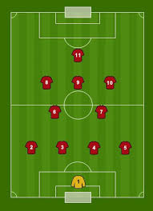

# Posiciones de los Jugadores

En el fútbol hay varias posiciones clave:

- Portero
- Defensa
- Mediocampista
- Delantero

=== "Defensa"
    === "Táctica 1"
        - **4-4-2:** Formación equilibrada con dos líneas de cuatro defensores.
    === "Táctica 2"
        - **5-3-2:** Defensa sólida con tres centrales y dos carrileros.

=== "Ataque"
    === "Táctica 1"
        - **4-3-3:** Presión alta con extremos abiertos y un delantero centro.
    === "Táctica 2"
        - **4-2-3-1:** Control del mediocampo con un enganche ofensivo y cuatro atacantes.
